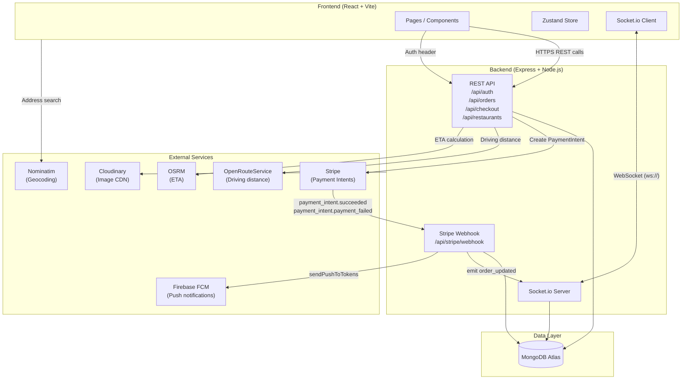

# Full-Stack Food Delivery Platform

A production-grade, full-stack food delivery application built with the MERN stack. Features real-time order tracking, secure Stripe payment processing, distance-based delivery pricing, and live push notifications.

**[🚀 View Live Demo](https://food-delivery-app-roan-ten.vercel.app)**

---

## Tech Stack

### Frontend

| Technology | Purpose |
|---|---|
| React 18 + Vite | UI framework & build tooling |
| TypeScript | Type safety across all components |
| Tailwind CSS | Utility-first styling |
| Zustand | Lightweight global state management |
| React Router DOM v6 | Client-side routing |
| Stripe Elements (React) | PCI-compliant payment UI |
| Socket.io Client | Real-time order status updates |
| Leaflet | Interactive delivery tracking map |

### Backend

| Technology | Purpose |
|---|---|
| Node.js + Express | REST API server |
| MongoDB + Mongoose | Document database & schema validation |
| Socket.io | WebSocket server for real-time events |
| Stripe Node SDK | Payment Intents + webhook processing |
| Firebase Admin SDK (FCM) | Mobile push notifications |
| express-rate-limit | Brute-force protection on auth + checkout |
| Sentry | Error monitoring & performance tracing |
| JSON Web Tokens (JWT) | Stateless authentication |

### External APIs

| API | Purpose |
|---|---|
| OpenRouteService | Driving distance calculation for delivery fee |
| OSRM (open.project-osrm.org) | Real-time ETA estimation |
| Nominatim (OpenStreetMap) | Address geocoding / place search |
| Cloudinary | Food image hosting & CDN |

### Deployment

| Layer | Platform |
|---|---|
| Frontend | Vercel |
| Backend | Render |
| Database | MongoDB Atlas |

---

## Architecture



---

## Getting Started

### Prerequisites

- Node.js ≥ 18
- MongoDB Atlas cluster (or local `mongod`)
- Stripe account (for test keys and webhook secret)
- A free [OpenRouteService API key](https://openrouteservice.org/)
- (Optional) Firebase project for push notifications

### 1. Clone the repository

```bash
git clone https://github.com/your-username/food-delivery-app.git
cd food-delivery-app
```

### 2. Install dependencies

```bash
# Backend
cd backend && npm install

# Frontend
cd ../frontend && npm install
```

### 3. Configure environment variables

Copy the example env files and fill in your own values:

```bash
cp backend/.env.example backend/.env
cp frontend/.env.example frontend/.env
```

**Backend `.env` key variables:**

| Variable | Description |
|---|---|
| `PORT` | Express server port (default `5000`) |
| `FRONTEND_URL` | Comma-separated allowed CORS origins (e.g. `http://localhost:5173`) |
| `MONGODB_URI` | MongoDB connection string |
| `JWT_SECRET` | Random secret for signing JWTs (min 16 chars) |
| `STRIPE_SECRET_KEY` | Stripe secret key (`sk_test_...`) |
| `STRIPE_WEBHOOK_SECRET` | Stripe webhook signing secret (`whsec_...`) |
| `OPENROUTESERVICE_API_KEY` | ORS API key for driving distance |
| `CLOUDINARY_CLOUD_NAME` | Cloudinary cloud name |
| `CLOUDINARY_API_KEY` | Cloudinary API key |
| `CLOUDINARY_API_SECRET` | Cloudinary API secret |
| `SENTRY_DSN` | (Optional) Sentry DSN for error tracking |
| `FIREBASE_PROJECT_ID` | (Optional) Firebase project for FCM |

**Frontend `.env` key variables:**

| Variable | Description |
|---|---|
| `VITE_API_URL` | Backend base URL (e.g. `http://localhost:5000`) |
| `VITE_STRIPE_PUBLISHABLE_KEY` | Stripe publishable key (`pk_test_...`) |

### 4. Seed the database

```bash
cd backend
node src/scripts/seed.js
```

This populates sample restaurants, menu items, and coordinates.

### 5. Start Stripe webhook forwarding (local dev)

```bash
# Install Stripe CLI: https://stripe.com/docs/stripe-cli
stripe listen --forward-to localhost:5000/api/stripe/webhook
```

Copy the webhook signing secret printed by the CLI into `STRIPE_WEBHOOK_SECRET` in `backend/.env`.

### 6. Run the dev servers

```bash
# In one terminal — backend
cd backend && npm run dev

# In another terminal — frontend
cd frontend && npm run dev
```

The app will be available at **http://localhost:5173**.

---

## Testing Payments

Use Stripe's official test card — no real charge will occur:

| Field | Value |
|---|---|
| Card number | `4242 4242 4242 4242` |
| Expiry | Any future date (e.g. `12/30`) |
| CVC | Any 3 digits (e.g. `123`) |
| ZIP | Any 5 digits (e.g. `12345`) |

After placing an order you'll be redirected to the live tracking page. In **development mode**, a **Dev Tools** panel appears at the bottom of the page — use it to simulate admin status updates (Preparing → Ready → Out for Delivery → Delivered) and watch the map update in real time via Socket.io.

---

## Known Limitations / Roadmap

This project is actively being extended toward a production multi-tenant architecture. Planned features include:

- **Role-Based Access Control (RBAC):** Strict authorization middleware separating `Customer`, `Restaurant_Admin`, and `Super_Admin` access levels with full data isolation.
- **Restaurant Merchant Portal:** A dedicated authenticated dashboard for restaurant owners to manage store hours, incoming orders, and menu items.
- **Dynamic Menu Management:** Full CRUD for food images (via Cloudinary upload), pricing, and real-time item availability toggling.
- **Order History & Analytics:** Customer order receipts and a sales chart for restaurant admins to track daily revenue.
- **Admin-side order management:** Real backend role enforcement so only authenticated restaurant staff — not customers — can advance order status through the state machine.

